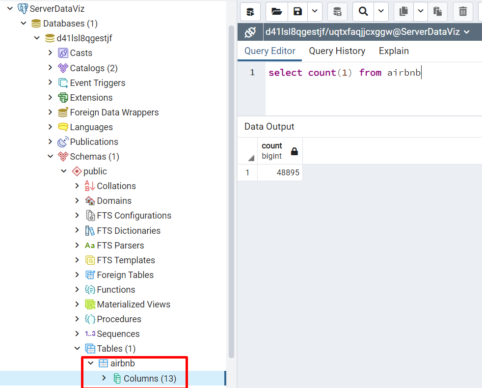

# Cargue y Limpieza de Datos

En este capítulo abordaremos el cargue de los datos de *Airbnb* de la ciudad de Nueva York en el año 2019.


## Carga de datos

El archivo `CSV` con el listado de Airbnb de la ciudad de Nueva York para el año 2019 descargado de *Kaggle* se cargará en una base de datos en `Heroku Postgress`. Pero para lograr esto, primero debemos cargar como `dataframe` el archivo  a través de la función `read.csv()`, agregando la instrucción `na = c("", "NA")` para tomar los valores vacíos como datos faltantes `na`.

```{r}
airbnb <- read.csv(file = "Datasets/AB_NYC_2019.csv", na = c("", "NA"))
head(airbnb)
```

Este archivo contiene 48.895 registros y 16 variables para análisis. En la siguiente sección revisaremos si existen datos faltantes en el dataset.

## Revisión de datos faltantes

Para determinar la existencia de datos faltantes en el dataframe *Airbnb*, primero determinaremos por columna cual es su proporción de valores `na`.

```{r}
pMiss <- function(x){sum(is.na(x))/length(x)*100}
apply(airbnb,2,pMiss)
```
Tenemos valores faltantes en las colunmnas `name`, `host_name`, `last_review` y `reviews_per_month`, sin embargo, solo estas dos últimas están por encima del umbral seguro (5%), lo que podría indicarnos a priori que son variables que deben eliminarse porque no aportarán al análisis. Sin embargo, esta es una decisión que debe tomarse con un mayor análisis de estos registros.

Haremos uso de la función `md.pattern` del paquete `mice`, que nos brinda visualmente el patrón de los datos faltantes, para un mejor entendimiento de estos. 

```{r  fig.height=9}
md.pattern(airbnb, plot = TRUE, rotate.names=TRUE)
```

El patrón nos indica que 38.821 registros no tienen datos faltantes, que los datos faltantes se encuentran en las colunmnas `name`, `host_name`, `last_review` y `reviews_per_month` (como habíamos encontrado anteriormente), con 16, 21, 10.052 y 10.052 registros, respectivamente. Adicionalmente, el mayor número de registros con datos faltantes (10.037) se encuentran en el patrón que solo contiene `na` en las columnas `last_review` y `reviews_per_month` y solo hay tres filas que contienen más de un valor perdido y de esas solo dos contienen más de dos valores perdidos.

Haciendo uso del paquete `VIM`, podemos ver la proporción de datos faltantes gráficamente. Por cuestión de espacio y mejor visualización del gráfico, trabajaremos solo con la columnas identificadas anteriormente que tienen datos faltantes.

```{r  fig.width=10}
airbnb_columns=airbnb[,c("name","host_name","last_review","reviews_per_month")]
aggr(airbnb_columns, numbers=TRUE, sortVars=TRUE, labels=names(data), cex.axis=.5, gap=3)
```

El gráfico de barras anterior, nos muestra que las columnas `last_review` y `reviews_per_month` representan la mayor proporción de datos faltantes y la proporción para la columnas `name` y `host_name` no es significativa. Este nuevo patrón nos complemente el anterior obtenido con el paquete `mice`puesto que nos indica adicionalmente que el 79,4% de los datos no tienen datos perdidos y nos muestra la proporción de filas que tienen un determinado patrón de datos perdidos, por ejemplo, el 20,52% tienen el patrón de datos perdidos sólo en las columnas en las columnas `last_review` y `reviews_per_month`.

El número de datos perdidos en el dataframe es bastante significativo (20.6%), sin embargo, al analizar lo que significan las columnas que los tienen, vemos por un lado que para el análisis posterior las columnas `name` y `host_name` no son necesarias y pueden eliminarse.

```{r}
borrar = c("name", "host_name")
airbnb = airbnb[, !(names(airbnb) %in% borrar)]
head(airbnb)
```

Por otro lado, al analizar los registros faltantes en las columnas `last_review` y `reviews_per_month`, encontramos que todos corresponden a aquellos donde no existen una evaluación por lo tanto, el manejo de estos datos es simple y se procede de la siguiente manera, se asigna un `0` en la columna `reviews_per_month` y se elimina la columna `last_review` por no tener valor significativo para nuestro análisis posterior. 

```{r}
borrar = c("last_review")
airbnb = airbnb[, !(names(airbnb) %in% borrar)]

airbnb <- mutate_at(airbnb, c("reviews_per_month"), ~replace(., is.na(.), 0))
head(airbnb)

```

En este punto nuestros datos ya no tienen valores faltantes y trabajaremos en adelante con un dataframe de 48.895 y 13 variables.

```{r}
apply(airbnb,2,pMiss)
```

## Creación en base de datos

El dataframe sin datos faltantes generado en la sección anterior debe cargarse en una base de datos en `Heroku Postgress`. Para esto primero debemos conectarnos a ella, usando la función `dbConnect()` con los datos apropiados.

```{r}
con <- dbConnect(RPostgres::Postgres(), 
                dbname = "d41lsl8qgestjf", 
                host = "ec2-3-229-43-149.compute-1.amazonaws.com", 
                port = 5432, 
                user = "uqtxfaqjjcxggw", 
                password = "916d311356954de6a99118d13578bb9d1b47bdc86cb8360a60b9606293bd882d")
```

Una vez tengamos establecida la conexión, insertamos los datos en la tabla `airbnb`, usando la función `dbWriteTable()`

```{r}
dbWriteTable(con, 'airbnb', airbnb, row.names=FALSE, overwrite=TRUE)
```

{hight=30}

Verifiquemos que podamos leer los datos, através de la función `dbGetQuery()`

```{r}
df = dbGetQuery(con, "SELECT * FROM airbnb")
summary(df)
```
