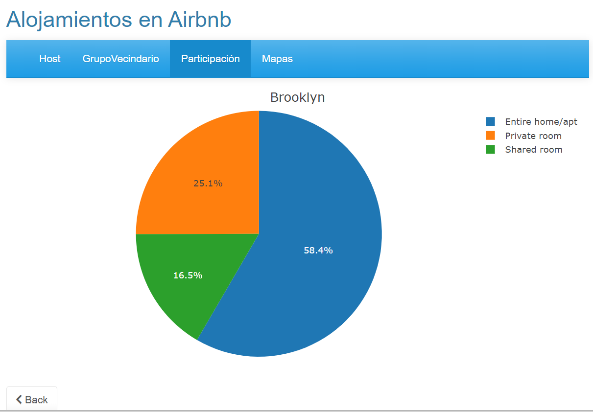

# Aplicación con Shiny

Con el análisis anterior, hemos contruido una aplicación web que se encuentra desplegada en el servidor de *ShinyApps.io* en la ruta https://zxzunm-adriana-palacio.shinyapps.io/Airbnb/.

La aplicación consta de 4 pestañas Host, Grupo Vecindario, Participación, Mapas.

## Host
Esta pestaña contiene información de los 5 anfitriones con más alojamientos distribuidos por grupo de vecindario.

Inicialmente nos muestra un gráfico con la cantidad de alojamientos que tienen los anfitriones seleccionados.

{}
Pero, al hacer click sobre una de las barras, nos genera un nuevo gráfico con la distribución de los alojamientos por grupo de vecindario para el host seleccionado.

{}

## Grupo Vecindario
Esta pestaña nos permite seleccionar el tipo de alojamiento (uno o más) y el grupo de alojamiento (solo uno) y nos muestra dos gráficos. El primero, con la información de los precios promedios por grupo de vecindario y tipo de alojamiento, este gráfico sólo se ve afectado por el filtro de tipo de alojamiento.

{}
Por otro  lado, el segundo gráfico nos muestra los precios promedios en los vencindarios del grupo escogido y los tipos de alojamientos seleccionados

{}

## Participación
Esta pestaña muestra el porcentaje de alojamientos por cada grupo de vecindario y en su hover nos da información sobre el grupo en el que estamos parados, el precio promeido de los alojamientos en este grupo y el porcentaje del mismo. 

{}
Si seleccionamos una sección de la torta, nos lleva a un gráfico del grupo de vecindario escogido y ahora la distribución de los alojamientos se muestra por tipo de alojamiento. En esta vista, contamos con un botón `back` para devovlernos a la primera gráfica.

{}

## Mapas
Esta última pestaña nos muestra en el primer gráfico la distribución de los alojamientos en New York por grupo de vecindario y en el segundo cómo son los precios en cada grupo.

{}
